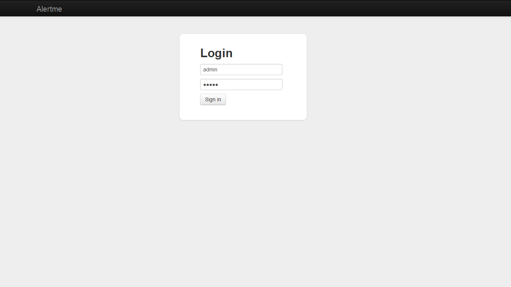
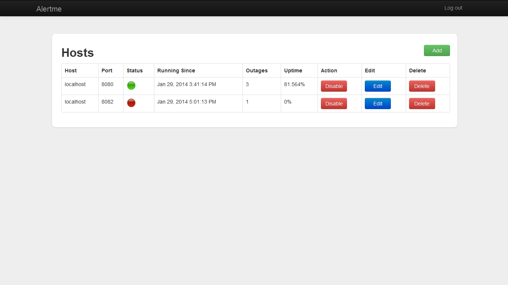

alertme
=======

Service and Server Monitoring app - Will send an email alert if somethings goes wrong 
 
#### How to get going :
 
 1. Install Node.js for your operating system.
 2. Create a folder for tingoDB in local system.
 3. Get a copy of code - https://github.com/bbytes/alertme.git to your local directory.
 4. Run the command - npm install -d - in Node command prompt after changing to your cloned directory.
    This should install the dependencies currently added in package.json file.
 5. Set path of your tingoDB folder to dbPath property in config/config.js.
 6. Set hostname and port on which you want to run your alertme in config/config.js.
 6. User credentials for the application in config.js file.
    
 
#### Running the application : 

 1. From the command prompt run - node app.js . You should be able to see a Login page at http://localhost:3333/alertme.
 2. Login with Admin user credentials : Username : admin, Password : admin
 3. Add hosts to alertme and enable monitoring.
 4. Now you will able see the status and number of outages etc.
          

#### Configuring the server

	dbPath : 'C:/tingoDB/data',
	app : {
		name : 'alertme',
		hostname : 'localhost',
		port : 3333
	},
	credentials : {
		username : "admin",
		password : "admin"
	},
	mail : {
		apiKey : 'key-xxxxxxt26ij',
		from : 'xyz@gmail.com',
		subject : 'AlertMe'
	}
 

## Features implemented 

### Configure via REST 
  Routes can be added or removed or updated using rest.

* __Adding host__ 
  * __method__ : POST, 
  * __url__ : /routes/save, 
  * __example route json__ : {"host" : "", "port" : "", "config" : {"enabled" : "false", "ping service" : "", "timeout" : "",
   							"ping interval" : "", "alert to" : "", "warning if takes more than" : "", "method" : "", "url" : "",
   						    "expectedStatuscode" : "", "expectedData" : ""}, "state" : {}}
* __Update host__ 
  * __method__ : POST
  * __url__ : /hosts/update
  * __data__ : hosts json to be updated
* __Delete host__
  * __method__ : POST
  * __url__ : /hosts/deleteHost
  * __data__ : {"id" : "7"}
* __Get all hosts__
  * __method__ : GET,
  * __url__ : /hosts/allHosts

### UI for adding and viewing status of servers or services

